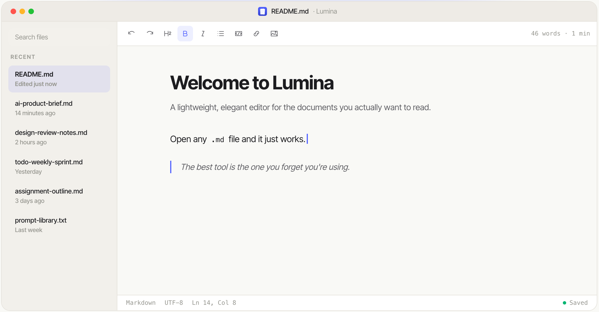

<p align="center">
  
</p>

<h1 align="center">Lumina</h1>

<p align="center"><em>A lightweight, elegant editor for the documents you actually want to read.</em></p>

<p align="center">
  <a href="https://github.com/micahman33/lumina/releases/latest">
    
  </a>
  <a href="https://github.com/micahman33/lumina/releases/latest">
    
  </a>
  
  
</p>

---

<p align="center">
  <a href="https://luminaeditor.com">
    
  </a>
</p>

---

Lumina is a WYSIWYG desktop editor for Markdown and plain text files. You write formatted text — Lumina handles the Markdown syntax behind the scenes. Open any `.md` or `.txt` file and it just works. No vault setup, no plugins, no configuration.

*The best tool is the one you forget you're using.*

---

## Download

| Platform | Installer | Requires |
|---|---|---|
| macOS (Apple Silicon) | [Lumina-1.6.6-arm64.dmg](https://github.com/micahman33/lumina/releases/download/v1.6.6/Lumina-1.6.6-arm64.dmg) | macOS 13+ · M1/M2/M3/M4 |
| Windows (x64) | [Lumina Setup 1.6.6.exe](https://github.com/micahman33/lumina/releases/download/v1.6.6/Lumina.Setup.1.6.6.exe) | Windows 10/11 |

**macOS:** Download the `.dmg`, drag Lumina to `/Applications`. On first launch, if macOS shows an "unverified developer" warning, right-click the app and choose **Open**.

**Windows:** Run the installer — Lumina is added to your Start Menu and Desktop automatically.

---

## Features

### Writing experience

- **WYSIWYG editing** — formatted text as you type; no raw Markdown syntax in your way
- **Auto Markdown shortcuts** — type `# ` for Heading 1, `**` for bold, `- ` for a bullet list, `> ` for a blockquote, ` ``` ` for a code block, and more
- **Floating toolbar** — select any text for an instant formatting bar right above your selection
- **Focus Mode** (`⌘⇧↩` / `Ctrl+Shift+Enter`) — collapses the sidebar and toolbar, narrows the canvas to 65 characters

### Formatting

| Element | Shortcut | Toolbar |
|---|---|---|
| Bold | `⌘B` / `Ctrl+B` | ✓ |
| Italic | `⌘I` / `Ctrl+I` | ✓ |
| Strikethrough | — | ✓ |
| Inline Code | — | ✓ |
| Link | `⌘K` / `Ctrl+K` | ✓ |
| Heading 1–4 | `#` + Space | ✓ Dropdown |
| Bullet List | `- ` + Space | ✓ |
| Numbered List | `1.` + Space | ✓ |
| Task List | `- [ ]` + Space | ✓ |
| Blockquote | `> ` + Space | ✓ |
| Code Block | ` ``` ` + Enter | ✓ |

### Images

- **Drag and drop** — drag any image from Finder or Explorer directly into the editor
- **Clipboard paste** — paste an image from your clipboard (`⌘V` / `Ctrl+V`) and it's inserted inline
- **Auto-organized** — images are copied into an `images/` subfolder next to your document and referenced with relative paths, so the folder stays self-contained and moveable
- **Toolbar insert** — pick a file via the system dialog using the image button in the toolbar
- **Resize** — click any image to select it, then drag the corner handle to resize; the width is saved with the file

### Tables

- **Table Wizard** — hover over a grid in the toolbar to choose any size, click to insert
- **Resizable columns** — drag column borders to adjust width
- **Right-click actions** — add or remove rows and columns from a context menu

### Links

- **Insert / edit** — `⌘K` / `Ctrl+K` with text selected, or use the toolbar
- **Open in browser** — click any link in the editor to open it externally
- **Anchor links** — `#heading` links scroll to the correct section within the document

### File management

- **Open** — `⌘O` / `Ctrl+O`, File menu, drag a `.md` file onto the window, or double-click from Finder/Explorer
- **Save / Save As** — `⌘S` and `⌘⇧S` / `Ctrl+S` and `Ctrl+Shift+S`
- **Auto-save** — changes are saved 2 seconds after you stop typing
- **Unsaved draft** — switching away from an unsaved new file preserves it as a scratchpad in the sidebar; click "Unsaved draft" to return to it
- **Recent files sidebar** — quick-access panel with search, pinning, rename, and Reveal in Finder/Explorer
- **Unsaved changes guard** — closing with unsaved work prompts Save / Don't Save / Cancel

### Export

- **PDF** — print-quality via Electron's print engine
- **HTML** — self-contained styled document, ready to share
- **Word (.docx)** — compatible with Microsoft Word and Google Docs

All exports available from the toolbar **Export** button or the Command Palette.

### Productivity

- **Command Palette** (`⌘⇧P` / `Ctrl+Shift+P`) — fuzzy-search every editor action and recent file from one panel
- **Find & Replace** (`⌘F` / `Ctrl+F`) — match counter, step-through navigation, replace one or all
- **Outline Panel** (`⌘⇧O` / `Ctrl+Shift+O`) — live heading tree; click any entry to scroll to it
- **Code blocks** — syntax highlighting for 25 languages with a language picker pill on each block
- **Mermaid diagrams** — fenced `mermaid` code blocks render as flowcharts, sequence diagrams, and more, with a toggle to view or edit the source

### Appearance

- **Light, Dark, and System** themes — follows your OS automatically, or set a manual preference
- **Plain text mode** — open `.txt` files without Markdown formatting; toolbar adjusts automatically

---

## Keyboard Shortcuts

| Action | macOS | Windows |
|---|---|---|
| New file | `⌘N` | `Ctrl+N` |
| Open file | `⌘O` | `Ctrl+O` |
| Save | `⌘S` | `Ctrl+S` |
| Save As | `⌘⇧S` | `Ctrl+Shift+S` |
| Bold | `⌘B` | `Ctrl+B` |
| Italic | `⌘I` | `Ctrl+I` |
| Insert / edit link | `⌘K` | `Ctrl+K` |
| Find & Replace | `⌘F` | `Ctrl+F` |
| Command Palette | `⌘⇧P` | `Ctrl+Shift+P` |
| Outline Panel | `⌘⇧O` | `Ctrl+Shift+O` |
| Focus Mode | `⌘⇧↩` | `Ctrl+Shift+Enter` |
| Undo | `⌘Z` | `Ctrl+Z` |
| Redo | `⌘⇧Z` | `Ctrl+Y` |

---

## What's New

### v1.6.7

- **Image resizing** — click any image to select it, then drag the handle at the bottom-right corner to resize; width persists on save
- **PDF export** — fixed margin issue that was causing layout problems on export

### v1.6.6

- **Mermaid diagrams** — fenced ` ```mermaid ` code blocks render as flowcharts, sequence diagrams, and more, with a Source/Preview toggle

[Full changelog →](CHANGELOG.md)

---

## Development

### Prerequisites

- [Node.js](https://nodejs.org) 18 or later
- npm 9 or later

### Getting Started

```bash
git clone https://github.com/micahman33/lumina.git
cd lumina
npm install
npm run dev        # development mode with HMR
```

### Building

```bash
npm run build      # compile TypeScript + Vite (output → out/)
npm run build:mac  # package for macOS → dist/*.dmg
npm run build:win  # package for Windows → dist/*.exe
```

> macOS builds must run on macOS. Windows builds must run on Windows.

### Testing

```bash
npm test           # run the full test suite (Vitest)
```

### Tech Stack

| Layer | Technology |
|---|---|
| Desktop shell | [Electron](https://electronjs.org) |
| Build tool | [electron-vite](https://electron-vite.org) |
| UI framework | React 18 + TypeScript |
| Editor engine | [TipTap v3](https://tiptap.dev) (ProseMirror) |
| Markdown I/O | [tiptap-markdown](https://github.com/aguingand/tiptap-markdown) |
| Styling | [Tailwind CSS](https://tailwindcss.com) + [@tailwindcss/typography](https://tailwindcss.com/docs/typography-plugin) |
| State | [Zustand](https://zustand-demo.pmnd.rs) |
| Persistence | [electron-store](https://github.com/sindresorhus/electron-store) |
| UI primitives | [Radix UI](https://www.radix-ui.com) |
| Icons | [Lucide React](https://lucide.dev) |

---

## License

Lumina is open source under the **GNU General Public License v3.0**.

You are free to use, modify, and distribute this software. If you distribute a modified version, you must also release your source code under the GPL v3. See [LICENSE](LICENSE) for the full terms.
